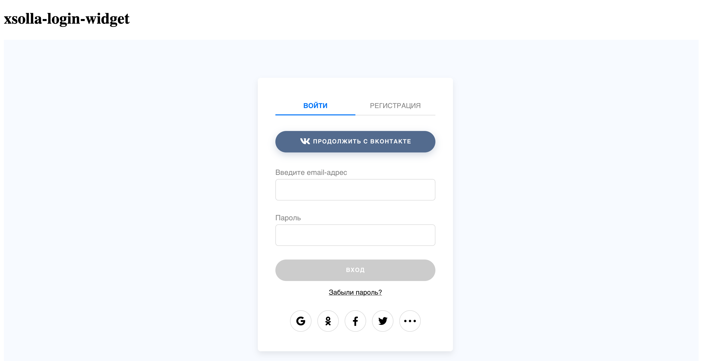
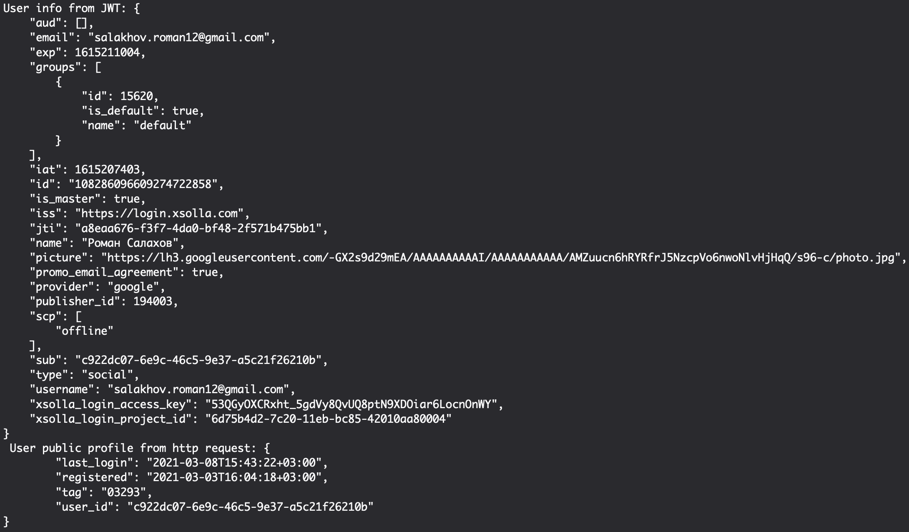

# Login Test Task
Тестовое задание для Xsolla Login

## Содержание
* [Задача](#Задача)
* [Требования и зависимости](#Требования-и-зависимости)
* [Что сделано](#Что-сделано)
* [Предложения по документации для интеграции](#Предложения-по-документации-для-интеграции)

## Задача
Необходимо встроить на сайт виджет авторизации Xsolla Login с протоколом OAuth2. После авторизации юзер должен увидеть страницу на которой отображается информация о нем
Необходимо проверить что:
- юзер успешно авторизуется с помощью виджета
- на бэке используется одна из готовых OAuth2 библиотек
- бэк обменивает code на access и refresh токены
- на бэке выполняется http на получение инфы о юзере
- инфа о юзере выводится на странице  
- документация для интеграции полная. Предложить пункты которых не хватает для интеграции или даже написать краткую инструкцию как нужно интегрироваться

## Требования и зависимости
- Go v1.15
- github.com/dgrijalva/jwt-go 
- github.com/gorilla/mux
- golang.org/x/oauth2 

## Что сделано
- Встроен виджет Xsolla Login новой версии
- Настроен проект авторизации с OAuth 2.0 в личном кабинете Publisher Account
- На бэке есть эндпоинт, на который возвращается код от сервиса авторизации
- Бэк обменивает код на JWT access и refresh токены через пакет oauth2
- Бэк расшифровыет JWT и выводит пользователю весь набор клэймов
- Бэк делает запрос к Login API c id пользователя и access токеном для получения данных профиля пользователя

### Отображение виджета

### Результат работы приложения

## Предложения по документации для интеграции
### Интеграция виджета
1. Создайте проект личном кабинете или перейдите в существующий
2. Перейдите в пункт "Авторизация" и заполните поля:
    - Название
    - Callback URL
    - Error callback URL
3. Нажмите "Добавить OAuth 2.0 аутентификацию" в разделе "Авторизация" и заполните поле "URI переадресации OAuth 2.0"
4. В разделе "Код виджета" выставьте необходимые параметры и скопируйте код виджета и вставьте его на ваш сайт.
5. В код виджета добавьте следующие поля к объекту "XsollaLogin.Widget":
    - responseType: 'code'
    - scope: 'offline'
    - state: '{ваше_значение}'
    - clientId: '{ваш_clientID}'

### Интеграция Login API
1. В вашем бэкенде в методе, который вы указали в Callback URI, 
сравните параметр запроса state с указанным параметром в виджете
2. Обменяйте пришедший код авторизации пользователя (параметр "code" в запросе) 
на JWT access и refresh токены с помощью готовой OAuth 2.0 библиотеки 
или через запрос [Generate JWT](https://developers.xsolla.com/login-api/methods/oauth-20/generate-jwt)
3. Используйте полученный токен для идентификации пользователя. 
Вы можете получить информацию о пользователе, дешифровав JWT.
4. Для дешифровки JWT используйте секретный ключ, указанный в 
разделе "Авторизация" в настройках проекта в личном кабинете
5. Используйте refresh токен для обновления access токена через запрос 
[Generate JWT](https://developers.xsolla.com/login-api/methods/oauth-20/generate-jwt)
с параметром grant_type=refresh_token

